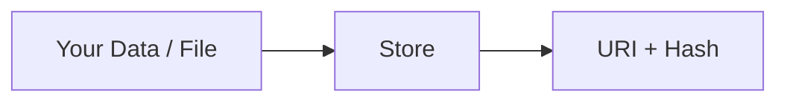
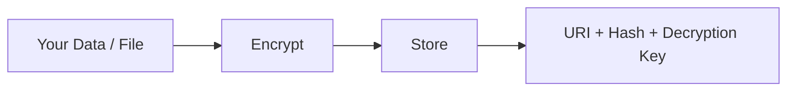

## Two Ways to Store Data

The service offers two ways to store data, depending on whether your content is public or private. Both options accept structured data (JSON) and binary files such as images or PDFs.

| Use Case                      | Endpoint   | What Happens                     |
| ----------------------------- | ---------- | -------------------------------- |
| Public data (JSON or binary)  | `/public`  | Stored as-is, without encryption |
| Private data (JSON or binary) | `/private` | Automatically encrypted          |

## The Lockbox Analogy

Think of the `/private` endpoint like a secure lockbox service.

When you store private data:

1. You hand over your data
2. The service locks it in a secure box
3. You receive the only key

Without that key, no one -- including the service operators -- can open the box. This is why it is critical to save your key immediately when you receive it.

## How Public Storage Works

Use public storage for data or files you are happy to share openly. Content is stored exactly as you send it at a public link, so anyone who obtains the link can read it.

**What happens:**

1. You send your data or file to the service
2. The service stores it exactly as you sent it
3. You receive back a **URI** (the location of your content) and a **hash** (a fingerprint to verify it has not changed)

## How Private Storage Works

Use private storage for any sensitive or confidential information that should be protected. The service encrypts your content automatically -- you do not need to encrypt it yourself.

**What happens:**

1. You send your data or file to the service
2. The service encrypts your content automatically
3. The encrypted content is stored
4. You receive back a **URI**, a **hash**, and a **decryption key**

:::warning Save Your Key

The decryption key is returned only once when you store your data.

**If you lose this key, your data cannot be recovered -- not even by the service operators.**

Store it securely immediately after receiving it.

:::

## When to Use Which Endpoint

| Scenario                                   | Recommended Endpoint |
| ------------------------------------------ | -------------------- |
| Public data (JSON or binary)               | `/public`            |
| Private or sensitive data (JSON or binary) | `/private`           |

:::info Note on Data Discovery

All stored items use UUIDs as identifiers. UUIDs are designed to be practically impossible to guess or enumerate, so discovery of a document's address is extremely unlikely. However, if someone does obtain a URI:

- **`/public`**: The data or file can be read directly
- **`/private`**: The data is encrypted and unreadable without the corresponding decryption key

This is why encryption matters for sensitive data -- it provides protection even if the URI is somehow discovered.

:::

## Scaling

The service is stateless and scales horizontally. You can run as many instances as needed behind a load balancer with no shared state between them. For detailed deployment and scaling guidance, see the [Scaling](../../deployment-guide/scaling) page.
